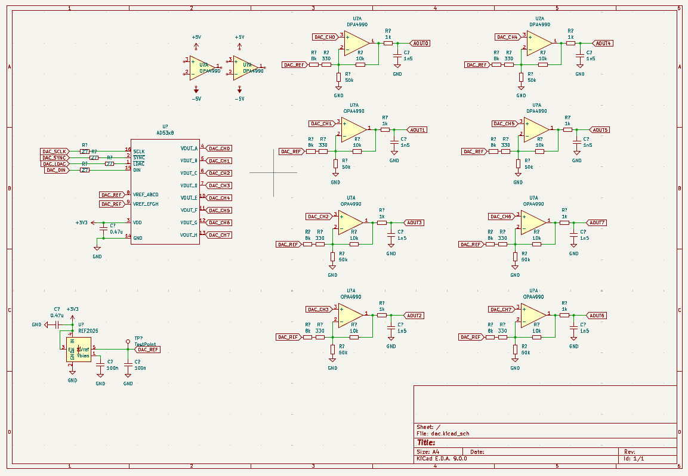
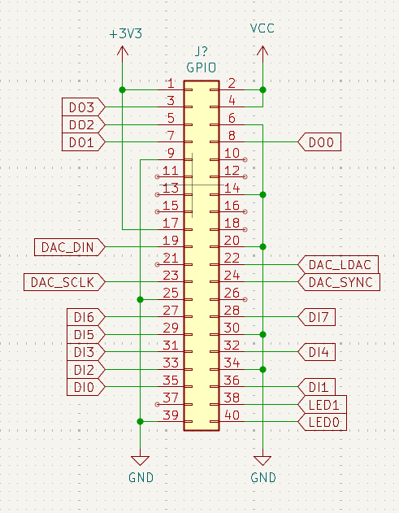
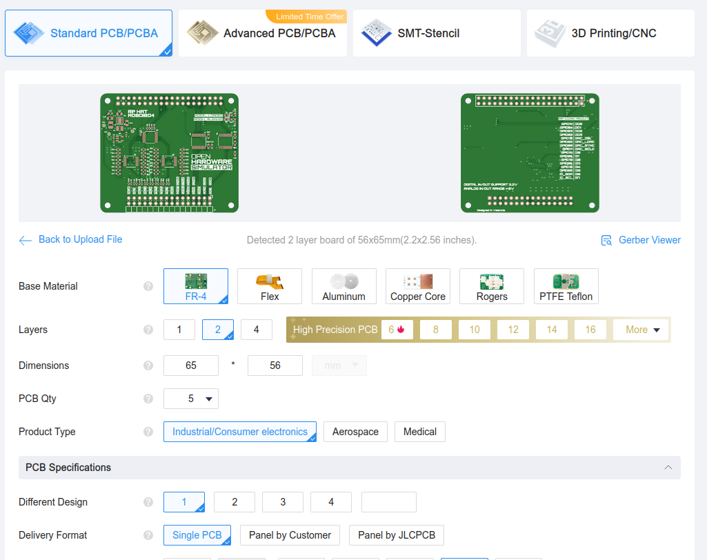

# 8-ch Analog output board

The DAC-8CH-RPI board features 8 analog outputs, 8 digital inputs and 4 digital outputs. It is intended to be used in real-time hardware simulators or signal generators. 

## Analog outputs

The board features an 8-channel DAC with a resolution of 12 bits, and a sampling rate of up to 100ksps. 

The output range goes from -3V to 3V.

## Raspberry Pi connector

The board features a 40-pin Raspberry PI Connector with the SPI interface for the DAc and the digital in-out.

This connector is compatible with FPGA boards such as Pynq-Z1, Pynq-Z2,AMD KR260 or MPFS Discovery Kit.

## Get Yours

The RP2040 PMOD is open-source, so you can use the output files to manufacture your own in [JLCPCB](https://jlcpcb.com/?from=controlpath). You just need to compress the `production_files` directory, and upload it to [JLCPCB](https://jlcpcb.com/?from=controlpath). 

Remember to change the Surface Finish to **LeadFree HASL** to make your board ROHS compliant.

Then you have to add the PCB Assembly service and upload the [centroid](./kicad/production_files/ohsim_hat_pos.csv) file, and the [BOM](./kicad/production_files/bom.csv). 

In a few days, you will receive your board at home. 